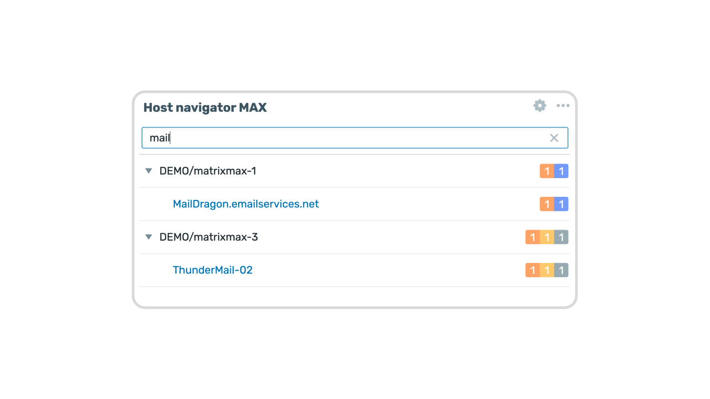

    
    <h3>
        
            Honesty, diligence and MAXimum knowledge of our products is our standard.
        
    </h3>
    <h3>
        &nbsp;&nbsp;&nbsp;
        &nbsp;&nbsp;&nbsp;
        &nbsp;&nbsp;&nbsp;
        &nbsp;&nbsp;&nbsp;
        &nbsp;&nbsp;&nbsp;
        
    </h3>

 

---
---

 
 

    <h1>
        Host navigator MAX
    </h1>
    <h4><i>
        Host navigator MAX is an enhanced version of the standard Zabbix Host navigator widget, featuring a powerful new search function to easily find hosts by name.
    </i></h4>
     
    
    
      
    

 
 

## Description

**Host navigator MAX** is a custom Zabbix widget that builds upon the standard **Host navigator** widget found in Zabbix 7.0 and 7.4.

It retains all the robust features of the original widget while introducing a highly anticipated new functionality: **the ability to search for hosts by name**. This addition makes navigating complex and large environments significantly faster and more intuitive.

### Key Features

- **Host Search by Name**: Quickly locate specific hosts using a dedicated, easy-to-use search bar integrated directly into the widget.
- **Native Experience**: Functions as an exact copy of the standard Zabbix Host navigator, ensuring seamless integration and a familiar user interface.
- **Multi-Version Support**: Fully compatible with Zabbix 7.0, 7.4, and PHP 8.0+.
- **Real-time Filtering**: Hosts are filtered as you type, with a clear button for quick reset.
- **Consistent UI**: Maintains the same look and feel as standard Zabbix widgets.

  

## Installation

For both **Zabbix 7.0** and **7.4**:

1. Copy the widget directory to your Zabbix installation
2. Navigate to **Administration > General > Modules**
3. Click **Scan directory** to auto-discover the widget
4. Enable "Host navigator MAX" from the list

The widget will then be available in the dashboard widget selection.

  

## Usage

Once installed, the widget:

1. **Displays** the full host hierarchy in your dashboard
2. **Provides** a search field at the top to filter hosts by name
3. **Updates** results in real-time as you type
4. **Shows** "No results found" if no hosts match your search
5. **Allows** quick reset using the clear button

Simply start typing a host name to filter the displayed hierarchy.

  

    <a href="https://www.initmax.com/wiki/hostnavigatormax">
         
        <b>Documentation</b> 
        
    </a>

    <h1>
        Host navigator MAX
    </h1>
    <h4><i>
        Host navigator MAX is an enhanced version of the standard Zabbix Host navigator widget, featuring a powerful new search function to easily find hosts by name.
    </i></h4>
     
    
    
      
    

 
 

## Description

**Host navigator MAX** is a custom Zabbix widget that builds upon the standard **Host navigator** widget found in Zabbix 7.0.

It retains all the robust features of the original widget while introducing a highly anticipated new functionality: **the ability to search for hosts by name**. This addition makes navigating complex and large environments significantly faster and more intuitive.

### Key Features

- **Host Search by Name**: Quickly locate specific hosts using a dedicated, easy-to-use search bar integrated directly into the widget.
- **Native Experience**: Functions as an exact copy of the standard Zabbix Host navigator, ensuring seamless integration and a familiar user interface.
- **Compatibility**: Fully compatible with Zabbix 7.0 and PHP 8.0.

  

    <a href="https://www.initmax.com/wiki/hostnavigatormax">
         
        <b>Documentation</b> 
        
    </a>

 
 

---
---

 

    <a href="https://www.initmax.com/">
         initMAX.com
    </a>&nbsp;&nbsp;&nbsp;
    <a href="tel:+420800244442">
         +420800244442
    </a>&nbsp;&nbsp;&nbsp;
    <a href="mailto:info@initmax.com">
         info@initmax.com
    </a>
       
    &nbsp;
    &nbsp;
    &nbsp;
    &nbsp;
    &nbsp;
       
    &nbsp;&nbsp;&nbsp;
    
       
    

